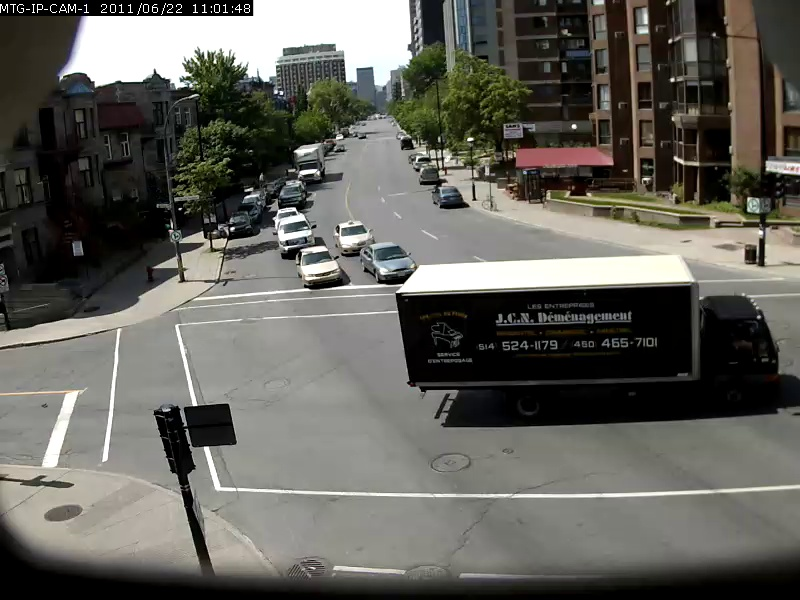
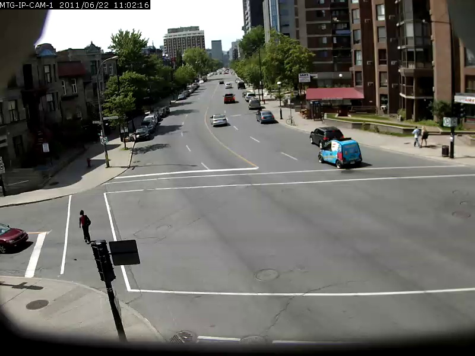

# Contrastive Language-Image Forensic Search


## Overview

CLIFS is a proof-of-concept for free text searching through videos for video frames with matching contents.
This is done using [OpenAI's CLIP](https://openai.com/blog/clip/) model, which is trained to match images with corresponding captions.
The searching is done by first extracting features from video frames using the CLIP image encoder and then
getting the features for the search query through the CLIP text encoder. The features are then matched by similarity
and the top results are returned, if above a set threshold.

To allow easy use of the CLIFS backend, a simple web server running django is used to provide a interface to the search engine. 


## Examples
To give an idea of the power of this model, a few examples are shown below, with the search query in bold and the result below.
These search queries are done against the 2 minute Sherbrooke video from the [UrbanTracker Dataset](https://www.jpjodoin.com/urbantracker/dataset.html).
Only the top image result for each query is shown. Note that the model is in fact quite capable of OCR.

#### A truck with the text "odwalla"

======

#### A white BMW car

======

#### A truck with the text "JCN"

======

#### A bicyclist with a blue shirt

======

#### A blue SMART car

======

## Setup
1. Run the setup.sh script to setup the folders and optionally download a video file for testing:
```sh
./setup.sh
```

2. Put your own video files that you want to index in the `data/input` directory

3. Build and start the search engine and web server containers through docker-compose:
```sh
docker-compose build && docker-compose up
```

Optionally, a docker-compose file with GPU support can be used if the host environment has a NVIDIA GPU and is setup for docker GPU support:

```sh
docker-compose build && docker-compose -f docker-compose-gpu.yml up
```
 
4. Once the features for the files in the `data/input` directory have been encoded, as shown in the log, navigate to [127.0.0.1:8000](http://127.0.0.1:8000) and search away.


